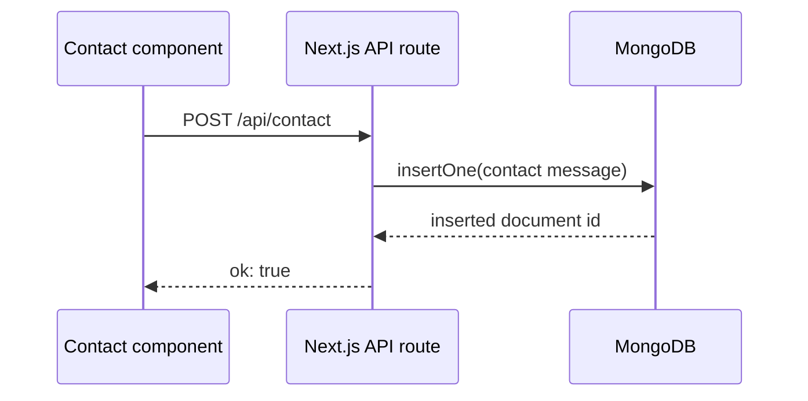

# API Documentation

## Overview

The project exposes a small API surface through Next.js route handlers. The implementation is in [app/api/[[...path]]/route.js](../app/api/[[...path]]/route.js).

## Base URL

When running locally:

```text
http://localhost:3000/api
```

## Authentication

Authentication is not implemented in the current API layer. All endpoints are publicly accessible unless the hosting environment or reverse proxy adds protection.

> Needs Manual Review: Production auth requirements and API gateway policies are not defined in source.

## Endpoints

### Health check

GET /api/health

#### Response

```json
{
  "status": "ok",
  "service": "portfolio-api",
  "time": "2026-07-22T00:00:00.000Z"
}
```

### Contact messages list

GET /api/contact/messages

#### Response

```json
{
  "items": []
}
```

### Submit contact message

POST /api/contact

#### Request body

```json
{
  "name": "Ada Lovelace",
  "email": "ada@example.com",
  "subject": "Project inquiry",
  "message": "Hello from the docs"
}
```

#### Success response

```json
{
  "ok": true,
  "id": "uuid"
}
```

#### Validation errors

```json
{
  "error": "name, email and message are required"
}
```

### Submit newsletter signup

POST /api/newsletter

#### Request body

```json
{
  "email": "subscriber@example.com"
}
```

#### Success response

```json
{
  "ok": true
}
```

## Request and Response Examples

### Contact form flow



## Error Codes

| Status | Meaning |
| --- | --- |
| 400 | Validation error such as missing required fields or invalid email |
| 404 | Route path not found |
| 500 | Internal server error |

## API Flow

1. The contact form validates required inputs on the client.
2. The client sends a JSON POST request to /api/contact.
3. The server validates the payload again.
4. The server writes the document to the MongoDB collection contact_messages.
5. The UI updates status to success or error.

## Data Contracts

### Contact message document

| Field | Type | Notes |
| --- | --- | --- |
| id | string | UUID |
| name | string | Trimmed to 200 chars |
| email | string | Trimmed to 200 chars |
| subject | string | Optional, trimmed to 300 chars |
| message | string | Required, trimmed to 5000 chars |
| createdAt | string | ISO timestamp |

### Newsletter document

| Field | Type | Notes |
| --- | --- | --- |
| id | string | UUID |
| email | string | Unique-ish upsert target |
| createdAt | string | ISO timestamp |

## Related Documentation

- [README](README.md)
- [Database](DATABASE.md)
- [Troubleshooting](TROUBLESHOOTING.md)
