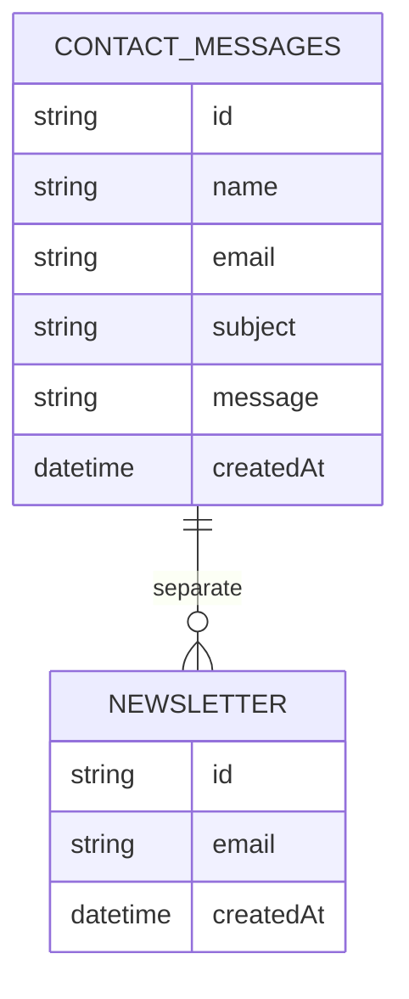

# Database Documentation

## Overview

The current project stores form submissions in MongoDB rather than using a relational database or ORM. The database connection is created lazily inside the API route and cached in memory for the lifetime of the process.

## Database Type

- Database engine: MongoDB
- Driver: mongodb
- Connection source: MONGO_URL environment variable
- Default database name: portfolio

## Schema

### Collection: contact_messages

| Field | Type | Required | Notes |
| --- | --- | --- | --- |
| id | string | Yes | UUID generated by uuidv4 |
| name | string | Yes | Truncated to 200 chars |
| email | string | Yes | Truncated to 200 chars |
| subject | string | No | Truncated to 300 chars |
| message | string | Yes | Truncated to 5000 chars |
| createdAt | string | Yes | ISO timestamp |

### Collection: newsletter

| Field | Type | Required | Notes |
| --- | --- | --- | --- |
| id | string | Yes | UUID generated by uuidv4 |
| email | string | Yes | Used as an upsert key |
| createdAt | string | Yes | ISO timestamp |

## Relationships

There are no relational joins or foreign keys in the current implementation. The collections are independent and used for different submission flows.

## Migrations

No migration framework is configured. The database is effectively schema-on-read and documents are created directly by the API route.

> Needs Manual Review: A migration strategy, indexes, and retention policy should be defined for production.

## Data Flow

## Operational Notes

- The API reads the latest contact messages with a sort by createdAt descending and a limit of 100.
- The API uses upsert behavior for newsletter entries.
- No explicit indexes are defined in the current source.

## Related Documentation

- [API](API.md)
- [Architecture](ARCHITECTURE.md)
- [Setup](SETUP.md)
