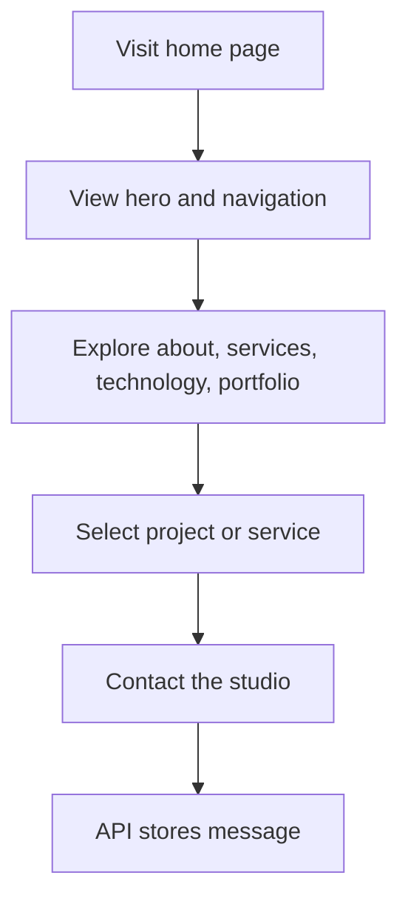

# Features

## 1. Animated Portfolio Experience

The landing page is a single-page experience with animated transitions, scroll-aware navigation, and rich motion cues. This is implemented through Framer Motion and a custom smooth scrolling layer.

## 2. Hero Section

The hero section introduces the studio brand, ambition, and service categories. It includes:
- animated headline
- CTA links for portfolio and consultation
- dynamic particle field background
- scrolling indicator

## 3. Navigation and Section Awareness

The navigation bar updates active state based on the browser scroll position. The mobile menu is also implemented for responsive navigation.

## 4. About Section

The about section presents the studio positioning, values, and expertise tags. It highlights a multidisciplinary team and the delivery philosophy.

## 5. Services Section

This section advertises service categories and a configurable launch experience. It surfaces a live demo button for the automotive configurator experience.

## 6. Technology Section

This section provides a structured overview of tools and platforms the studio serves.

## 7. Project Portfolio

The portfolio section displays featured projects as cards with:
- image preview
- category label
- short description
- tech tag list
- external links for demo, source, and case study

Users can filter the cards by category using the pill buttons.

## 8. Contact Form

The contact form collects:
- name
- email
- subject
- message

Client-side validation checks for required fields and a valid email format before submission. The form then calls the API endpoint and updates status state.

## 9. Newsletter Submission

The footer includes a newsletter form UI. The current implementation is wired to a submit handler that prevents default form behavior and is intended to integrate with the newsletter API route.

## 10. Visual Design System

The site uses custom CSS utilities for glassmorphism, gold/purple gradient accents, borders, and marquee effects. This creates the polished visual language used throughout the site.

## User Flow

## Business Logic

- The portfolio content is content-driven and editable through the shared data module.
- Service categories and project metadata are centralised so the marketing pages can be updated consistently.
- Contact submissions are persisted to support lead capture.
- The app is designed to support future integrations such as CRM sync or email notification.

## Related Documentation

- [README](README.md)
- [Architecture](ARCHITECTURE.md)
- [API](API.md)
